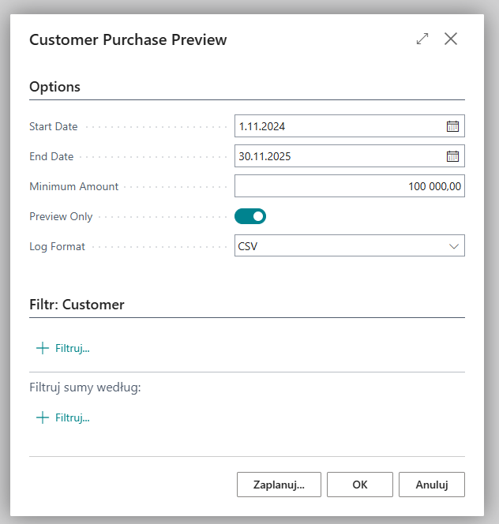
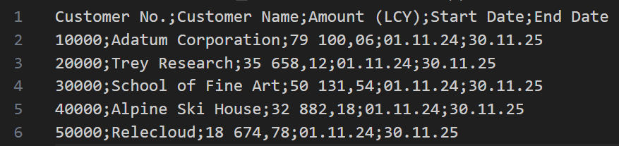
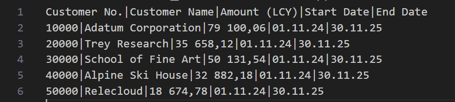

# Write Log To File
This extension allows you to generate log file in csv or txt formats with easy extensibility through an interface.
\
\
You can use it in situations where you want to check a data set before making any changes to it. 
\
In this case, you can save the data set, e.g. to a csv file and check if it is correct.

## Demo
The project contains a demo report, that analyzes customers and compares the total posted sales invoices against a minimum amount in the given date range. Customers that do not meet the threshold are either blocked or written to a log file (preview mode).
\
\
On the request page user can specify:
- Start Date - start of the Posting Date. Default = beginning of the previous month
- End Date - end of the Posting Date. Default = end of the previous month
- Min Amount - minimum invoice total within the date range. Below the threshold the customer is qualified for blocking/preview.
- Preview Only - when enabled, the report does NOT modify data and only generates a log file
- Log Format - log file format (CSV or Text). Enabled only when Preview Only = true

\
File logging is used for a safe preview before applying changes. The file contains columns: Customer No., Customer Name, Amount (LCY), Start Date, End Date, so you can verify the customer list and amounts before blocking them.
\
\
**Report Request Page**
\

\
\
**Csv log**
\

\
\
**Txt Log**
\

